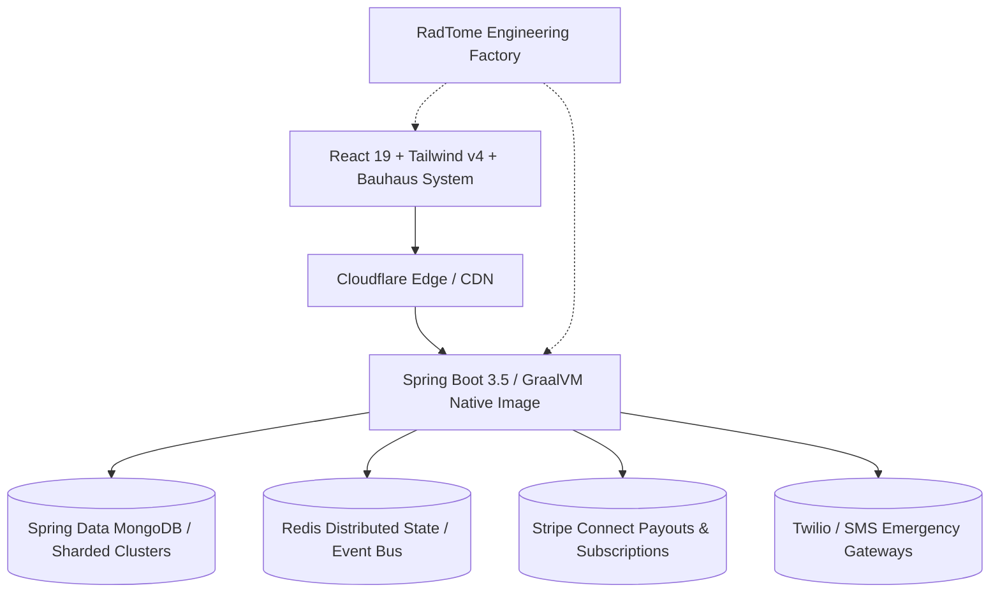

# OrgSets Community Hub & Open Issue Tracker

Welcome to the public community hub, feedback forum, and issue tracker for **[OrgSets](https://orgsets.com)** — the all-in-one hierarchical multi-tenant platform built for leagues, chapters, associations, and networks.

OrgSets is designed and maintained by **[RadTome](https://radtome.com)**, a software project organization and SaaS factory creating high-performance developer tools, edge runtimes, and distributed cloud applications.

---

## 🌐 Ecosystem Links

| Destination | Purpose | URL |
| :--- | :--- | :--- |
| **OrgSets Platform** | Production Multi-Tenant SaaS | [orgsets.com](https://orgsets.com) |
| **RadTome Parent Org** | Software Project Organization & Engineering Factory | [radtome.com](https://radtome.com) |
| **Community Documentation & SEO Site** | Architecture, Feature Matrix & Live Simulator | [radtome.github.io/OrgSets](https://radtome.github.io/OrgSets/) |
| **GitHub Issues** | Report Bugs & Submit Feature Proposals | [RadTome/OrgSets/issues](https://github.com/RadTome/OrgSets/issues) |
| **GitHub Discussions** | Q&A, Feedback, Ideas, and Community Showcase | [RadTome/OrgSets/discussions](https://github.com/RadTome/OrgSets/discussions) |

---

## 🏛️ What is OrgSets?

Traditional organization tools force communities into flat spreadsheets, fragmented chat channels, or rigid corporate enterprise suites. **[OrgSets](https://orgsets.com)** bridges this gap with:

- **Hierarchical Node Trees:** Infinite parent/child organization inheritance. A national headquarters (Council) can supervise regional districts (Districts), which coordinate local branches (Chapters), each managing local squads (Units).
- **The Forge (Tenant Engine):** Per-organization branding, custom color palettes, custom terminology overrides, and bespoke role-based access control (RBAC).
- **Automated Ledger & Split Engine:** Stripe Connect integration that automatically routes membership dues, tournament splits, and fees up and down the organization tree with real-time auditability.
- **Pulse Broadcast Network:** Multi-channel emergency and informational broadcast system delivering urgent notices via SMS gateways and in-app alerts.
- **Digital Compliance Vault:** Hierarchical, tamper-resistant document management for bylaws, waivers, insurance certs, and background checks.
- **Sponsor/Dependent Graph:** Family and guardian linking with sandboxed mirroring for minor safety and youth athletics.
- **Democratic Governance:** Built-in secret-ballot elections, quorum tracking, and certified polling.

---

## 🏗️ Architecture & RadTome Lineage

OrgSets is engineered using **RadTome's** high-throughput cloud architecture:

- **Backend:** Java 21, Spring Boot 3.5, GraalVM AOT Native Image compilation for sub-50ms cold starts and minimal memory overhead.
- **Frontend:** React 19, TypeScript, Bauhaus / New Brutalist design system with high-contrast accessibility.
- **Persistence:** Spring Data MongoDB with strict AOT mapping and distributed transactional integrity.
- **Parent Lineage:** Part of the [RadTome](https://radtome.com) toolchain alongside [QuickSnipe](https://radtome.com) (E-Commerce listing sniper), [MCP Codex](https://mcp-codex.com) (Model Context Protocol directory), and [PrettyPrint](https://prettyprint.radtome.com) (Local-first formatter).

---

## 🎯 Purpose of this Repository

This repository serves as the **open community coordination center**:

1. **Bug Reporting:** Find a glitch or edge-case? [Open a Bug Report](https://github.com/RadTome/OrgSets/issues/new?template=bug_report.yml).
2. **Feature Proposals:** Want new ledger logic, specialized voting methods, or calendar integrations? [Submit a Feature Request](https://github.com/RadTome/OrgSets/issues/new?template=feature_request.yml).
3. **Discussions:** Chat with fellow administrators, scoutmasters, club officers, and league coordinators in [GitHub Discussions](https://github.com/RadTome/OrgSets/discussions).
4. **Public Documentation & Knowledge Hub:** Hosted via GitHub Pages in [`/docs`](https://radtome.github.io/OrgSets/).

---

## 🤝 Contributing & Community Standards

We love feedback and community participation! Please review:
- [Contributing Guidelines](./CONTRIBUTING.md)
- [Code of Conduct](./CODE_OF_CONDUCT.md)
- [Security Policy](./SECURITY.md)

---

## 📄 License

Community guidelines, templates, and documentation in this repository are licensed under the [MIT License](./LICENSE). The core OrgSets platform and RadTome infrastructure are proprietary cloud software operated by [RadTome](https://radtome.com).
